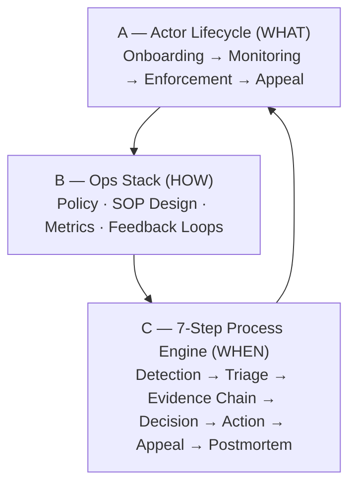

# Risk Governance Portfolio

> _"I don't just manage the process — I am the process. I write the standards, run the audits, investigate the failures, and turn every finding into a durable governance upgrade."_
>
> _我不只是管流程的人——我就是写标准、跑审计、查根因、把每个发现变成持久治理升级的那个人。_

>

---

## What This Repo Is

A working governance portfolio — not a resume supplement. Every document in this repo demonstrates how governance work gets designed and operationalized — policy frameworks, enforcement SOPs, case playbooks, audit methodology, and KPI definitions.

The content maps directly to the four pillars of the Risk Governance Policy Specialist role at TikTok Business Integrity — translated to the advertiser risk surface: ATO, impersonation, bad debt, policy circumvention, and fraudulent ad content.

---

## JD → Experience Mapping

| JD Responsibility                                                                                         | Approach                                                                                                                     | Where                        |
| --------------------------------------------------------------------------------------------------------- | ---------------------------------------------------------------------------------------------------------------------------- | ---------------------------- |
| Own the Actor Suspension policy framework — scope, definitions, enforcement criteria                      | Evidence chain standards governing sanctions decisions, designed to survive regulatory audit                                 | [`/frameworks`](frameworks/) |
| Build operationally actionable standards — evidence requirements, decision guidelines, write-up standards | Tiered enforcement SOP: HITL→HOOL routing, canary-to-GA rollout gates, P0 incident response                                  | [`/frameworks`](frameworks/) |
| Edge case reviews → codify into policy clarifications and decision trees                                  | Confusion matrix slice analysis surfacing hidden false positive clusters; packaged into policy exception + retraining signal | [`/cases`](cases/)           |
| Calibration and enablement to reduce inconsistency across reviewers and regions                           | 500-case blind audits tracking Precision/Recall/F1 by reviewer, region, and content category                                 | [`/metrics`](metrics/)       |

---

## Governance Model

Everything in this repo operates within a three-layer framework. Understanding how the layers connect is prerequisite to reading any individual document.

**How they connect:**

- Layer A defines the lifecycle stages that trigger Layer C process instances
- Layer B (ops stack) powers every step of Layer C
- The **feedback loop** ties all three: every postmortem → policy update → SOP revision → raises the bar for the next detection cycle

> See [`docs/governance-frameworks-map.md`](docs/governance-frameworks-map.md) for how this maps to Three Lines Model, NIST AI RMF, PDCA, DMAIC, and ITIL.

---

## Repo Contents

### `/frameworks` — The Rulebook

| File                                                                  | What It Contains                                                                                             |
| --------------------------------------------------------------------- | ------------------------------------------------------------------------------------------------------------ |
| [`actor-suspension-policy.md`](frameworks/actor-suspension-policy.md) | Evidence tiers (1–3), consequence levels (L0–L5), appeal rights and standards, version control protocol      |
| [`tiered-enforcement-sop.md`](frameworks/tiered-enforcement-sop.md)   | HITL / HOTL / HOOL confidence routing, 7-step execution sequence, canary rollout gates, P0 incident response |
| [`7-step-process-engine.md`](frameworks/7-step-process-engine.md)     | Detection through postmortem — with the feedback loop that turns every failure into a governance upgrade     |

### `/cases` — Applied Policy per Risk Type

| File                                                                                         | Risk Type                                                                                                                                                                                              |
| -------------------------------------------------------------------------------------------- | ------------------------------------------------------------------------------------------------------------------------------------------------------------------------------------------------------ |
| [`ato-account-takeover.md`](cases/ato-account-takeover.md)                                   | Unauthorized third-party control of a legitimate advertiser account                                                                                                                                    |
| [`impersonation.md`](cases/impersonation.md)                                                 | False identity claim — brand, agency, or individual                                                                                                                                                    |
| [`bad-debt-overspend.md`](cases/bad-debt-overspend.md)                                       | Ad spend exceeding recoverable credit exposure                                                                                                                                                         |
| [`policy-circumvention.md`](cases/policy-circumvention.md)                                   | Intentional evasion — new accounts, proxies, cloaking, threshold structuring                                                                                                                           |
| [`fraudulent-ad-content.md`](cases/fraudulent-ad-content.md)                                 | Misleading claims, prohibited categories, deceptive landing pages                                                                                                                                      |
| [`platform-merchant-governance-pdd-2026.md`](cases/platform-merchant-governance-pdd-2026.md) | Case study — PDD "Ghost Delivery" enforcement action (April 2026, ¥3.6B fine): governance failure taxonomy, 7-step engine analysis, policy gaps, and translation to TikTok Ads advertiser risk surface |

### `/metrics` — How the System Is Measured

| File                                                         | What It Contains                                                                    |
| ------------------------------------------------------------ | ----------------------------------------------------------------------------------- |
| [`quality-audit-system.md`](metrics/quality-audit-system.md) | 500-case blind audit protocol, stratified sample design, slice analysis methodology |
| [`kpi-definitions.md`](metrics/kpi-definitions.md)           | Every metric with precise formula, data source, owner, target, and alert threshold  |
| [`system-health-report.md`](metrics/system-health-report.md) | Monthly reporting template — executive summary through open items                   |

### `/docs` — Reference

| File                                                                | What It Contains                                                                |
| ------------------------------------------------------------------- | ------------------------------------------------------------------------------- |
| [`governance-frameworks-map.md`](docs/governance-frameworks-map.md) | How Three Lines, NIST AI RMF, ISO 31000, PDCA, DMAIC, and ITIL map to this role |
| [`mandarin-glossary.md`](docs/mandarin-glossary.md)                 | 广告主诚信与行为治理术语表 — bilingual EN/中文 terminology                      |

---

## Build Status

See [`ROADMAP.md`](ROADMAP.md) for the full build plan. Current phase:

- [x] Phase 1a — Initial skeleton (14 files) committed
- [x] Phase 1b — README render pass
- [x] Phase 1c — `CONTRIBUTING.md` methodology explainer
- [ ] Phase 2 — Human refinement: frameworks → cases → metrics → docs
- [ ] Phase 3 — HTML portfolio page + GitHub Pages

---

_April 2026 · [ROADMAP](ROADMAP.md) · [Methodology](CONTRIBUTING.md)_

---
